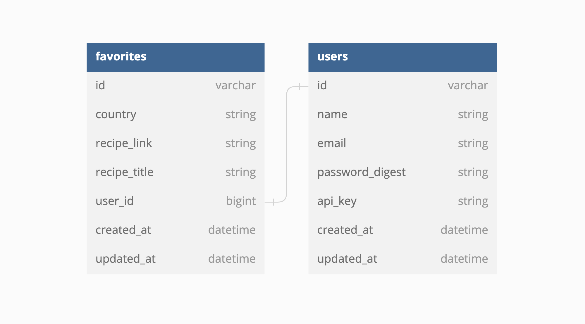

<a name="readme-top"></a>

<!-- PROJECT SHIELDS -->
[![Contributors][contributors-shield]][contributors-url]
[![LinkedIn][LinkedIn]][LinkedIn-url]

<br>

<div align="center">

# Lunch and Learn

[![Rails][Rails]][Rails-url] [![Ruby][Ruby]][Ruby-url] [![RSpec][RSpec]][RSpec-url] [![Atom][Atom]][Atom-url] [![PostgreSQL][PostgreSQL]][PostgreSQL-url] [![Postman][Postman]][Postman-url]

[![XCode][XCode]][XCode-url] [![Homebrew][Homebrew]][Homebrew-url] [![MacOS][MacOS]][MacOS-url]

</div>

## Description

Backend SOA application to search for cuisines by country and provide opportunity to learn more about that country.

_For more examples, please refer to the [Documentation](https://backend.turing.edu/module3/projects/lunch_and_learn/requirements)_

<br>

<!-- TABLE OF CONTENTS -->
<details>
  <summary>Table of Contents</summary>
  <ol>
    <li><a href="#architecture">Architecture</a></li>
    <li>
      <a href="#getting-started">Getting Started</a>
      <ul>
        <li><a href="#prerequisites">Prerequisites</a></li>
        <li><a href="#installation">Installation</a></li>
      </ul>
    </li>
    <li><a href="#gem-documentation">Gem Documentation</a></li>
    <li>
      <a href="#endpoints">Endpoints</a>
      <ul>
        <li><a href="#recipes">Recipes</a></li>
        <li><a href="#country-missing">Country Missing</a></li>
        <li><a href="#learning-resources">Learning Resources</a></li>
        <li><a href="#create-user">Create User</a></li>
        <li><a href="#add-favorite">Add Favorite</a></li>
        <li><a href="#get-favorites">Get Favorites</a></li>
        <li><a href="#delete-favorite">Delete Favorite</a></li>
        <li><a href="#tourist-sights">Tourist Sights</a></li>
      </ul>
    </li>  
    <li><a href="#contact">Contact</a></li>
  </ol>
</details>
<br>

<!-- Architecture -->
## Architecture

# 

---
<p align="right">(<a href="#readme-top">back to top</a>)</p>

<!-- GETTING STARTED -->
## Getting Started

### Prerequisites

This is an example of how to list things you need to use the software and how to install them.
_<a href="https://developer.apple.com/xcode/" target="_blank" rel="noopener noreferrer">Xcode</a> and <a href="https://docs.brew.sh/Installation" target="_blank" rel="noopener noreferrer">Homebrew</a> is recommended for Mac._

Ruby:
  ```sh
  rbenv install 2.7.4
  ```
Rails:
  ```sh
  gem install rails --version 5.2.8
  ```
PostgreSQL@14<a href="https://www.postgresql.org/download/" target="_blank" rel="noopener noreferrer">(Windows)</a> or if using Homebrew:
  ```sh
  brew install postgresql
  brew services start postgresql
  ```
API Keys:
Lunch and Learn uses <a href="https://developer.edamam.com/edamam-recipe-api" target="_blank" rel="noopener noreferrer">Edamam API</a>, <a href="https://developers.google.com/youtube/v3/getting-started" target="_blank" rel="noopener noreferrer">YouTube API</a>, <a href="https://www.geoapify.com/get-started-with-maps-api" rel="noopener noreferrer">Geoapify API</a>, <a href="https://restcountries.com/#api-endpoints-v3" rel="noopener noreferrer">RestCountries API V.3</a>, and <a href="https://unsplash.com/developers" rel="noopener noreferrer">Unsplash API</a>

---
<p align="right">(<a href="#readme-top">back to top</a>)</p>

### Installation

Instructions to set up a local version of Lunch and Learn:

Fork and clone the project, then install the required gems with `bundle`. A full list of gems that will be installed can be found in the [gemfile][gemfile-url].

```sh
bundle install
```

Reset the database:

```sh
rake db:{drop,create,migrate}
```

Run:

```sh
bundle exec figaro install
```

In `config/application.yml` add API keys:

```sh
edamam_id: 'YOUR EDAMAM ID'
edamam_recipe_api: 'YOUR EDAMAM KEY'

YouTube_API: 'YOUR YOUTUBE KEY'
Secret key: 'YOUR YOUTUBE SECRET KEY'

Unsplash_Access_Key: 'YOUR UNSPLASH ACCESS KEY'

geoapify_key: 'YOUR GEOAPIFY KEY'
```

Push to your preferred production server or in your terminal run
 ```sh
  rails server
 ```
Then open [http://localhost:3000](http://localhost:3000) in your browser.

---
<p align="right">(<a href="#readme-top">back to top</a>)</p>

## Gem Documentation

* [bcrypt][bcrypt-docs]
* [capybara][capybara-docs]
* [factory_bot_rails][factory_bot_rails-docs]
* [faker][faker-docs]
* [faraday][faraday-docs]
* [figaro][figaro-docs]
* [jsonapi-serializer][jsonapi-serializer-docs]
* [pry][pry-docs]
* [rspec-rails][rspec-rails-docs]
* [shoulda-matchers][shoulda-matchers-docs]
* [simplecov][simplecov-docs]
* [vcr][vcr-docs]
* [webmock][webmock-docs]

---
<p align="right">(<a href="#readme-top">back to top</a>)</p>

## Endpoints

Endpoints to use in Postman running a local server `rails s`

### Recipes

#### Random Country
```sh
  GET '/api/v1/recipes'
```

#### Selected Country

```sh
  GET '/api/v1/recipes?country=thailand'
```

**Sample Response**

```sh
{
    "data": [
        {
            "id": null,
            "type": "recipe",
            "attributes": {
                "title": "Andy Ricker's Naam Cheuam Naam Taan Piip (Palm Sugar Simple Syrup)",
                "url": "https://www.seriouseats.com/recipes/2013/11/andy-rickers-naam-cheuam-naam-taan-piip-palm-sugar-simple-syrup.html",
                "country": "thailand",
                "image": "https://edamam-product-images.s3.amazonaws.com..."
            }
        },
        {
            "id": null,
            "type": "recipe",
            "attributes": {
                "title": "Sriracha",
                "url": "http://www.jamieoliver.com/recipes/vegetables-recipes/sriracha/",
                "country": "thailand",
                "image": "https://edamam-product-images.s3.amazonaws.com/."
            }
        },
        {...},
        {...},
        {...},
        {etc},
    ]
}
```

---
<p align="right">(<a href="#readme-top">back to top</a>)</p>

```sh
  GET '/api/v1/recipes?country=djibouti'
```

**Sample Response(no recipes for random or selected country)**

```sh
{
    "data": [
        "message",
        "No recipes for Djibouti"
    ]
}
```

---
<p align="right">(<a href="#readme-top">back to top</a>)</p>

#### Country Missing

```sh
  GET '/api/v1/recipes?country='
```

**Sample Response(country missing from endpoint)**

```sh
  {
    "data": []
  }
```

---
<p align="right">(<a href="#readme-top">back to top</a>)</p>

### Learning Resources

#### Random Country

```sh
  GET  '/api/v1/learning_resources'
```

  #### or select a country

```sh
  GET '/api/v1/learning_resources?country=<country of your choice as parameter>'
```

**Sample Response**

```sh
{
    "data": {
        "id": null,
        "type": "learning_resource",
        "attributes": {
            "country": "laos",
            "video": {
                "title": "A Super Quick History of Laos",
                "youtube_video_id": "uw8hjVqxMXw"
            },
            "images": [
                {
                    "alt_tag": "standing statue and temples landmark during daytime",
                    "url": "https://images.unsplash.com/photo-1528181304800-259b08848526?ixid=MnwzNzg2NzV8MHwxfHNlYXJjaHwxfHx0aGFpbGFuZHxlbnwwfHx8fDE2Njc4Njk1NTA&ixlib=rb-4.0.3"
                },
                {
                    "alt_tag": "five brown wooden boats",
                    "url": "https://images.unsplash.com/photo-1552465011-b4e21bf6e79a?ixid=MnwzNzg2NzV8MHwxfHNlYXJjaHwyfHx0aGFpbGFuZHxlbnwwfHx8fDE2Njc4Njk1NTA&ixlib=rb-4.0.3"
                },
                {
                    "alt_tag": "orange temples during daytime",
                    "url": "https://images.unsplash.com/photo-1563492065599-3520f775eeed?ixid=MnwzNzg2NzV8MHwxfHNlYXJjaHwzfHx0aGFpbGFuZHxlbnwwfHx8fDE2Njc4Njk1NTA&ixlib=rb-4.0.3"
                },
                {...},
                {...},
                {...},
                {etc},
              ]
        }
    }
}
```

**Sample Response(no video or images found)**

```sh
{
  "data": {
      "id": null,
      "type": "learning_resource",
      "attributes": {
          "country": "Nameofcountry", # this value is the value used to search for learning resources
          "video": [],
          "images": []
      }
  }
}
```

---
<p align="right">(<a href="#readme-top">back to top</a>)</p>

### Create User

```sh
  POST /api/v1/user
```

**Sample Body**

```sh
 {
   "name": "Athena Dao",
   "email": "athenadao@bestgirlever.com"
 }
```

**Sample Response**

```sh
  {
    "data": {
      "type": "user",
      "id": "1",
      "attributes": {
        "name": "Athena Dao",
        "email": "athenadao@bestgirlever.com",
        "api_key": "jgn983hy48thw9begh98h4539h4"
      }
    }
  }
```

---
<p align="right">(<a href="#readme-top">back to top</a>)</p>

### Add Favorite

```sh
  POST '/api/v1/favorites'
```

**Sample Body**

```sh
 {
    "api_key": "jgn983hy48thw9begh98h4539h4",
    "country": "thailand",
    "recipe_link": "https://www.tastingtable.com/.....",
    "recipe_title": "Crab Fried Rice (Khaao Pad Bpu)"
 }
```

**Sample Response**

```sh
 {
    "success": "Favorite added successfully"
 }
```

---
<p align="right">(<a href="#readme-top">back to top</a>)</p>

### Get Favorites

```sh
  GET '/api/v1/favorites'
```

**Sample Body**

```sh
 {
   "api_key": "jgn983hy48thw9begh98h4539h4"
 }
```

**Sample Response**

```sh
{
   "data": [
       {
           "id": "1",
           "type": "favorite",
           "attributes": {
               "recipe_title": "Recipe: Egyptian Tomato Soup",
               "recipe_link": "http://www.thekitchn.com/recipe-egyptian-tomato-soup-weeknight....",
               "country": "egypt",
               "created_at": "2022-11-02T02:17:54.111Z"
           }
       },
       {
           "id": "2",
           "type": "favorite",
           "attributes": {
               "recipe_title": "Crab Fried Rice (Khaao Pad Bpu)",
               "recipe_link": "https://www.tastingtable.com/.....",
               "country": "thailand",
               "created_at": "2022-11-07T03:44:08.917Z"
           }
       }
   ]
}    
```

---
<p align="right">(<a href="#readme-top">back to top</a>)</p>

### Delete Favorite

```sh
  DELETE '/api/v1/favorites'
```

---
<p align="right">(<a href="#readme-top">back to top</a>)</p>

### Tourist Sights

```sh
  GET '/api/v1/tourist_sights?country=France'
```

  **Sample Response**

```sh
  {
    "data": [
        {
            "id": null,
            "type": "tourist_sight",
            "attributes": {
                "name": "Tour de l'horloge",
                "address": "Tour de l'horloge, Allée de l'Horloge, 23200 Aubusson, France",
                "place_id": "51d28..."
            }
        },
        {
            "id": null,
            "type": "tourist_sight",
            "attributes": {
                "name": "Le Château",
                "address": "Le Château, D 18, 23150 Ahun, France",
                "place_id": "51934..."
            }
        },
        {
            "id": null,
            "type": "tourist_sight",
            "attributes": {
                "name": "Le Chapître",
                "address": "Le Chapître, Rue du Chapitre, 23200 Aubusson, France",
                "place_id": "517182..."
            }
        },
        ...,
        ...,
    ]
}
```

---
<p align="right">(<a href="#readme-top">back to top</a>)</p>

## Contact

[AMSterling](https://terminal.turing.edu/profiles/1525)

[![GitHub][GitHub Badge]][GitHub-url] [![LinkedIn][LinkedIn]][LinkedIn-url]

Project Link: [https://github.com/AMSterling/lunch-and-learn](https://github.com/AMSterling/lunch-and-learn)

<p align="right">(<a href="#readme-top">back to top</a>)</p>

<!-- MARKDOWN LINKS & IMAGES -->
<!-- https://www.markdownguide.org/basic-syntax/#reference-style-links -->
[contributors-shield]: https://img.shields.io/github/contributors/AMSterling/lunch-and-learn.svg?style=for-the-badge
[contributors-url]: https://github.com/AMSterling/lunch-and-learn/graphs/contributors
[forks-shield]: https://img.shields.io/github/forks/AMSterling/lunch-and-learn.svg?style=for-the-badge
[forks-url]: https://github.com/AMSterling/lunch-and-learn/network/members
[gemfile-url]: https://github.com/AMSterling/lunch-and-learn/blob/main/Gemfile
[stars-shield]: https://img.shields.io/github/stars/AMSterling/lunch-and-learn.svg?style=for-the-badge
[stars-url]: https://github.com/AMSterling/lunch-and-learn/stargazers
[issues-shield]: https://img.shields.io/github/issues/AMSterling/lunch-and-learn.svg?style=for-the-badge
[issues-url]: https://github.com/AMSterling/lunch-and-learn/issues
[license-shield]: https://img.shields.io/github/license/AMSterling/lunch-and-learn.svg?style=for-the-badge
[license-url]: https://github.com/AMSterling/lunch-and-learn/blob/master/LICENSE.txt
[LinkedIn]: https://img.shields.io/badge/-LinkedIn-black.svg?style=for-the-badge&logo=linkedin&colorB=555
[LinkedIn-url]: https://linkedin.com/in/sterling-316a6223a/

[Atom]: https://img.shields.io/badge/Atom-66595C?style=for-the-badge&logo=Atom&logoColor=white
[Atom-url]: https://github.com/atom/atom/releases/tag/v1.60.0

[Bootstrap]: https://img.shields.io/badge/bootstrap-%23563D7C.svg?style=for-the-badge&logo=bootstrap&logoColor=white
[Bootstrap-url]: https://getbootstrap.com/

[Capybara]: https://custom-icon-badges.demolab.com/badge/Capybara-F7F4EF?style=for-the-badge&logo=capybara
[Capybara-url]: https://www.patreon.com/capybara

[CircleCI]: https://img.shields.io/badge/circle%20ci-%23161616.svg?style=for-the-badge&logo=circleci&logoColor=white
[CircleCI-url]: https://circleci.com/developer

[CSS]: https://img.shields.io/badge/CSS-239120?&style=for-the-badge&logo=css3&logoColor=white
[CSS-url]: https://en.wikipedia.org/wiki/CSS

[Fly]: https://custom-icon-badges.demolab.com/badge/Fly-DCDCDC?style=for-the-badge&logo=fly-io
[Fly-url]: https://fly.io/

[Git Badge]: https://img.shields.io/badge/GIT-E44C30?style=for-the-badge&logo=git&logoColor=white
[Git-url]: https://git-scm.com/

[GitHub Badge]: https://img.shields.io/badge/GitHub-100000?style=for-the-badge&logo=github&logoColor=white
[GitHub-url]: https://github.com/AMSterling/

[GitHub Actions]: https://img.shields.io/badge/github%20actions-%232671E5.svg?style=for-the-badge&logo=githubactions&logoColor=white
[GitHub Actions-url]: https://github.com/features/actions

[GraphQL]: https://img.shields.io/badge/-GraphQL-E10098?style=for-the-badge&logo=graphql&logoColor=white
[GraphQL-url]: https://graphql.org/

[Heroku]: https://img.shields.io/badge/Heroku-430098?style=for-the-badge&logo=heroku&logoColor=white
[Heroku-url]: https://www.heroku.com/

[Homebrew]: https://custom-icon-badges.demolab.com/badge/Homebrew-2e2a24?style=for-the-badge&logo=homebrew_logo
[Homebrew-url]: https://brew.sh/

[HTML5]: https://img.shields.io/badge/html5-%23E34F26.svg?style=for-the-badge&logo=html5&logoColor=white
[HTML5-url]: https://en.wikipedia.org/wiki/HTML5

[JavaScript]: https://img.shields.io/badge/javascript-%23323330.svg?style=for-the-badge&logo=javascript&logoColor=%23F7DF1E
[JavaScript-url]: https://www.javascript.com/

[jQuery]: https://img.shields.io/badge/jquery-%230769AD.svg?style=for-the-badge&logo=jquery&logoColor=white
[jQuery-url]: https://github.com/rails/jquery-rails

[LinkedIn Badge]: https://img.shields.io/badge/LinkedIn-0077B5?style=for-the-badge&logo=linkedin&logoColor=white
[LinkedIn-url]: https://www.linkedin.com/in/<Username>/

[MacOS]: https://img.shields.io/badge/mac%20os-000000?style=for-the-badge&logo=macos&logoColor=F0F0F0
[MacOS-url]: https://www.apple.com/macos

[Miro]: https://img.shields.io/badge/Miro-050038?style=for-the-badge&logo=Miro&logoColor=white
[Miro-url]: https://miro.com/

[Postgres]: https://img.shields.io/badge/postgres-%23316192.svg?style=for-the-badge&logo=postgresql&logoColor=white
[Postgres-url]: https://www.postgresql.org/

[PostgreSQL]: https://img.shields.io/badge/PostgreSQL-316192?style=for-the-badge&logo=postgresql&logoColor=white
[PostgreSQL-url]: https://www.postgresql.org/

[Postman]: https://img.shields.io/badge/Postman-FF6C37?style=for-the-badge&logo=postman&logoColor=white
[Postman-url]: https://web.postman.co/

[Rails]: https://img.shields.io/badge/rails-%23CC0000.svg?style=for-the-badge&logo=ruby-on-rails&logoColor=white
[Rails-url]: https://rubyonrails.org/

[Redis]: https://img.shields.io/badge/redis-%23DD0031.svg?&style=for-the-badge&logo=redis&logoColor=white
[Redis-url]: https://redis.io/

[Replit]: https://img.shields.io/badge/replit-667881?style=for-the-badge&logo=replit&logoColor=white
[Replit-url]: https://replit.com/

[RSpec]: https://custom-icon-badges.demolab.com/badge/RSpec-fffcf7?style=for-the-badge&logo=rspec
[RSpec-url]: https://rspec.info/

[RuboCop]: https://img.shields.io/badge/RuboCop-000?logo=rubocop&logoColor=fff&style=for-the-badge
[RuboCop-url]: https://docs.rubocop.org/rubocop-rails/index.html

[Ruby]: https://img.shields.io/badge/Ruby-000000?style=for-the-badge&logo=ruby&logoColor=CC342D
[Ruby-url]: https://www.ruby-lang.org/en/

[Slack]: https://img.shields.io/badge/Slack-4A154B?style=for-the-badge&logo=slack&logoColor=white
[Slack-url]: https://slack.com/trials?remote_promo=f4d95f0b&utm_medium=ppc&utm_source=google&utm_campaign=ppc_google_amer_en_brand_selfserve_discount&utm_term=Slack_Exact_._slack_._e_._c&utm_content=611662283461&gclid=Cj0KCQiA54KfBhCKARIsAJzSrdptOf7OUrgfeH0CWCC7LaOjR8arXoBnBMZjUSTJqmzTKvH6Jh-YXzAaAjfWEALw_wcB&gclsrc=aw.ds

[Tailwind]: https://img.shields.io/badge/tailwindcss-%2338B2AC.svg?style=for-the-badge&logo=tailwind-css&logoColor=white
[Tailwind-url]: https://tailwindcss.com/

[Visual Studio Code]: https://img.shields.io/badge/Visual%20Studio%20Code-0078d7.svg?style=for-the-badge&logo=visual-studio-code&logoColor=white
[Visual Studio Code-url]: https://code.visualstudio.com/

[XCode]: https://img.shields.io/badge/Xcode-007ACC?style=for-the-badge&logo=Xcode&logoColor=white
[XCode-url]: https://developer.apple.com/xcode/

[Zoom]: https://img.shields.io/badge/Zoom-2D8CFF?style=for-the-badge&logo=zoom&logoColor=white
[Zoom-url]: https://zoom.us/

[bcrypt-docs]: https://github.com/bcrypt-ruby/bcrypt-ruby
[capybara-docs]: https://github.com/teamcapybara/capybara
[factory_bot_rails-docs]: https://github.com/thoughtbot/factory_bot_rails
[faker-docs]: https://github.com/faker-ruby/faker
[faraday-docs]: https://lostisland.github.io/faraday/
[figaro-docs]: https://github.com/laserlemon/figaro
[jsonapi-serializer-docs]: https://github.com/jsonapi-serializer/jsonapi-serializer
[launchy-docs]: https://www.rubydoc.info/gems/launchy/2.2.0
[omniauth-google-oauth2-docs]: https://github.com/zquestz/omniauth-google-oauth2
[orderly-docs]: https://github.com/jmondo/orderly
[pry-docs]: https://github.com/pry/pry
[rspec-rails-docs]: https://github.com/rspec/rspec-rails
[shoulda-matchers-docs]: https://github.com/thoughtbot/shoulda-matchers
[simplecov-docs]: https://github.com/simplecov-ruby/simplecov
[vcr-docs]: https://github.com/vcr/vcr
[webmock-docs]: https://github.com/bblimke/webmock
